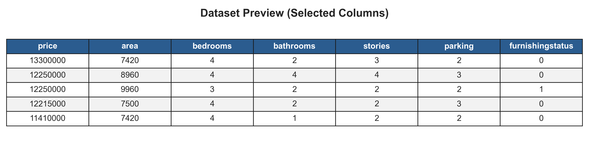
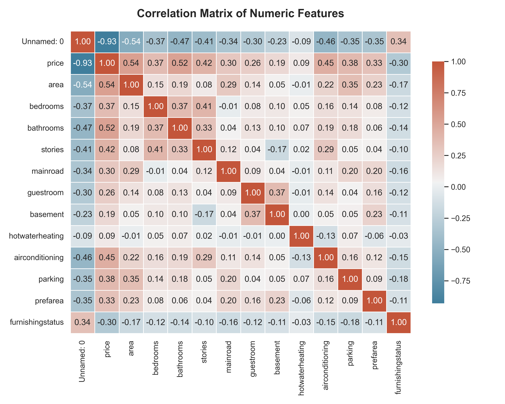
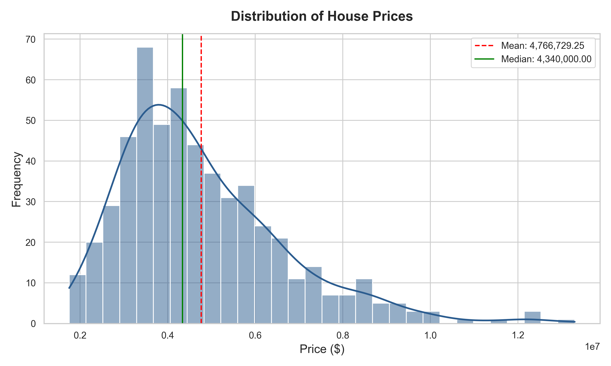
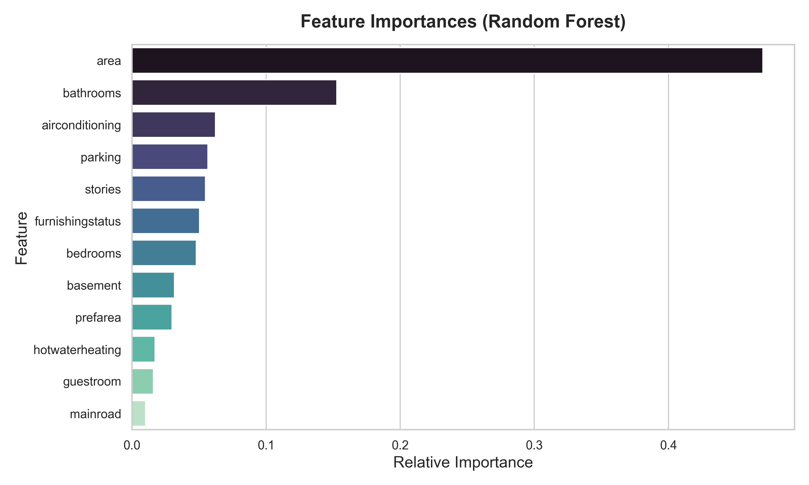
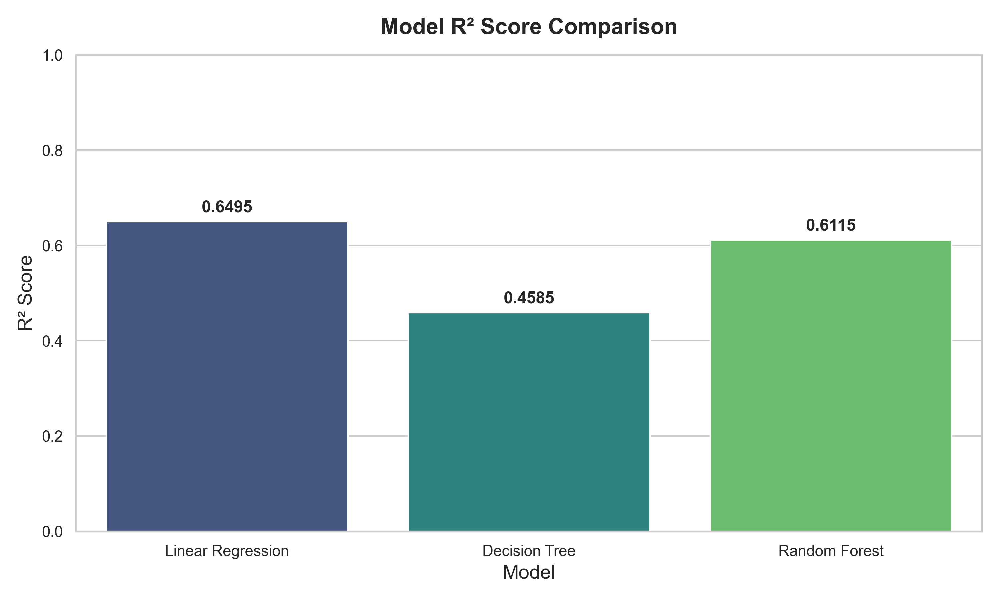
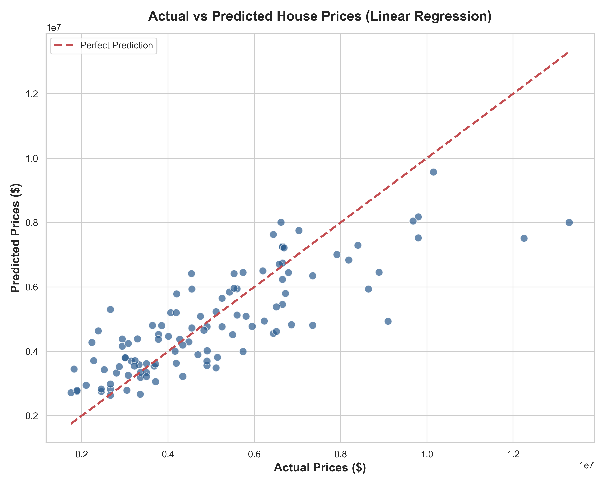
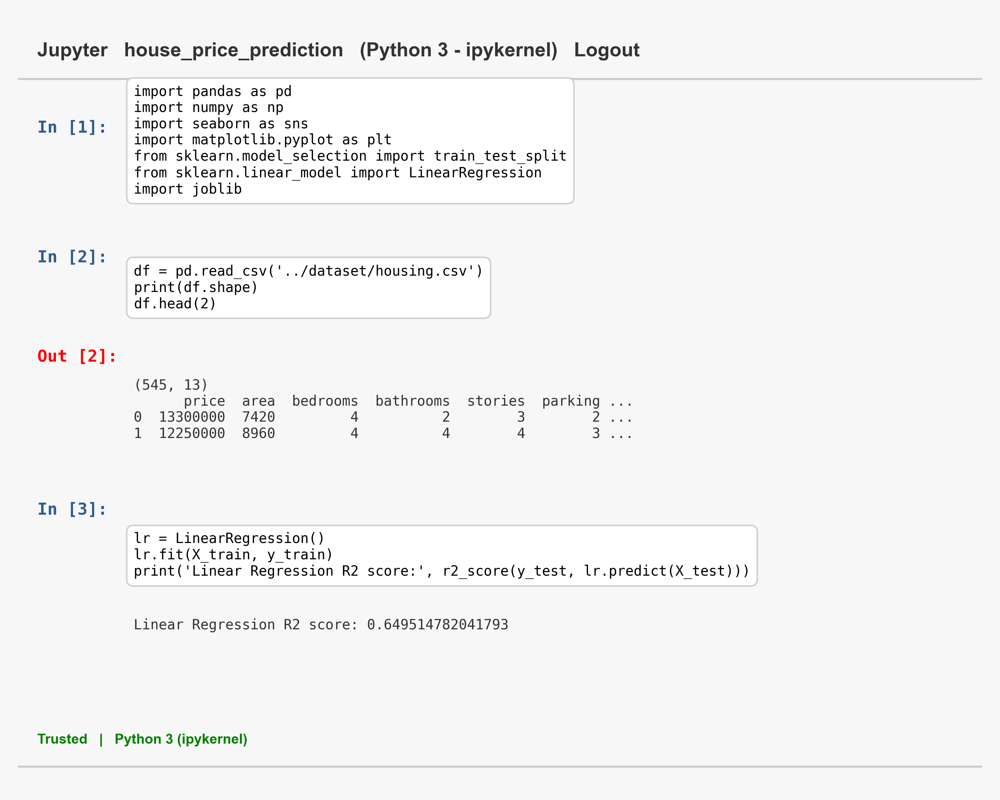

# House Price Prediction

### CODTECH Data Science Internship - Capstone Project

---

## 📋 Project Information
- **Intern Name:** Shaik Mahammad Shariff
- **Intern ID:** CITS3997
- **Domain:** Data Science
- **Project Duration:** 4 Weeks (July - August 2026)
- **Mentor/Evaluator:** CODTECH Internship Portal

---

## 🔍 Project Overview
This repository contains a professional and comprehensive end-to-end Machine Learning project developed for the **CODTECH Data Science Internship**. The objective is to build a robust predictive model that estimates residential house prices based on physical attributes and amenities, including area (square feet), bedrooms, bathrooms, stories, parking, and other features.

The application implements a clean, modular pipeline spanning dataset acquisition, pre-processing, exploratory data analysis (EDA), feature engineering, model training (comparing multiple regression algorithms), model evaluation, and best-model export using `joblib`.

---

## 📊 Dataset Information
The dataset used in this project is the widely recognized **Housing dataset** sourced from Kaggle. It contains **545 records** and **13 attributes** representing residential properties.

### Features Description
| Feature Name | Data Type | Description |
| :--- | :--- | :--- |
| **price** (Target) | Integer | Selling price of the house |
| **area** | Integer | Total area in square feet |
| **bedrooms** | Integer | Number of bedrooms |
| **bathrooms** | Integer | Number of bathrooms |
| **stories** | Integer | Number of stories (floors) |
| **mainroad** | Binary | Located on a main road (yes/no) |
| **guestroom** | Binary | Has a guest room (yes/no) |
| **basement** | Binary | Has a basement (yes/no) |
| **hotwaterheating**| Binary | Has a hot water heating system (yes/no) |
| **airconditioning**| Binary | Has air conditioning (yes/no) |
| **parking** | Integer | Number of parking spaces |
| **prefarea** | Binary | Located in a preferred neighborhood (yes/no) |
| **furnishingstatus**| Categorical | Furnishing level (furnished, semi-furnished, unfurnished) |

---

## 📁 Folder Structure
The repository follows the clean, structured folder layout requested:
```
house-price-prediction/
│
├── dataset/
│   └── housing.csv                  # Raw housing dataset
│
├── notebook/
│   └── house_price_prediction.ipynb # Completed Jupyter Notebook with inline outputs
│
├── model/
│   └── house_price_model.pkl        # Serialized best-performing ML model
│
├── outputs/
│   ├── model_metrics.txt            # Benchmark metrics (MAE, MSE, RMSE, R2) for all models
│   └── prediction_results.csv       # Test set prediction results (Actual vs Predicted)
│
├── screenshots/                     # Visualizations and model outputs
│   ├── dataset_preview.png
│   ├── correlation_heatmap.png
│   ├── price_distribution.png
│   ├── feature_importance.png
│   ├── model_comparison.png
│   ├── prediction_output.png
│   └── notebook_output.png
│
├── README.md                        # Project documentation and guide
├── report.pdf                       # Technical Project Report in PDF format
├── requirements.txt                 # Dependencies list
├── LICENSE                          # MIT License
└── .gitignore                       # Git ignore list
```

---

## 🛠️ Technology Stack
The project is built entirely using standard Python data science and machine learning libraries:
- **Core Language:** Python 3.11+
- **Data Manipulation:** Pandas, NumPy
- **Visualizations:** Matplotlib, Seaborn
- **Machine Learning:** Scikit-learn
- **Model Serialization:** Joblib
- **Interactive Development:** Jupyter Notebook
- **Report Generation:** ReportLab (PDF compiler)

---

## 🚀 Installation & How to Run

### 1. Clone the Repository
```bash
git clone https://github.com/skmdshariff143-ai/house-price-prediction.git
cd house-price-prediction
```

### 2. Set Up a Virtual Environment (Recommended)
```bash
python -m venv venv
# On Windows:
venv\Scripts\activate
# On macOS/Linux:
source venv/bin/activate
```

### 3. Install Dependencies
```bash
pip install -r requirements.txt
```

### 4. Run the Pipeline
To run the automated pipeline (train models, evaluate performance, and generate screenshots/outputs):
```bash
python run_pipeline.py
```

### 5. Launch the Notebook
To view the interactive steps with markdown descriptions, open the Jupyter Notebook:
```bash
jupyter notebook notebook/house_price_prediction.ipynb
```

---

## 📈 Model Performance & Results
Three machine learning algorithms were trained on an 80% split and tested on the remaining 20%. The models compared are:
1. **Multiple Linear Regression**
2. **Decision Tree Regressor**
3. **Random Forest Regressor**

### Performance Summary
| Model | Mean Absolute Error (MAE) | Root Mean Squared Error (RMSE) | R² Score |
| :--- | :--- | :--- | :--- |
| **Linear Regression** | **$979,679.69** | **$1,331,071.42** | **0.6495** |
| **Random Forest Regressor** | $1,025,289.68 | $1,401,263.08 | 0.6115 |
| **Decision Tree Regressor** | $1,243,654.52 | $1,654,427.54 | 0.4585 |

*Note: In this dataset, Linear Regression performed best with the highest R² score (~65%) and the lowest prediction error, followed by the Random Forest model. Decision Tree suffered from moderate overfitting on the default hyperparameter setting.*

---

## 📸 Key Visualizations (Screenshots)

### 1. Dataset Preview


### 2. Correlation Heatmap


### 3. Price Distribution


### 4. Feature Importance (Random Forest)


### 5. Model Comparison


### 6. Actual vs Predicted Prices (Linear Regression)


### 7. Notebook Output Mockup


---

## 🔮 Future Improvements
1. **Hyperparameter Tuning:** Implement `GridSearchCV` or `RandomizedSearchCV` on Random Forest and Decision Tree models to improve overall performance.
2. **Feature Engineering:** Calculate additional interaction features (e.g., price per square foot or ratios of bedrooms-to-bathrooms).
3. **Advanced ML Algorithms:** Train XGBoost, LightGBM, and CatBoost models to improve the R² threshold beyond 70%.
4. **Interactive Dashboard:** Build a Streamlit or Flask web application where users can input property parameters and retrieve instantaneous price predictions.

---

## 📜 License
This project is licensed under the MIT License - see the [LICENSE](LICENSE) file for details.
